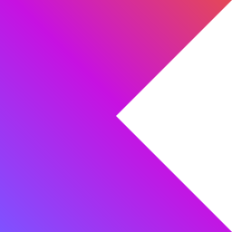
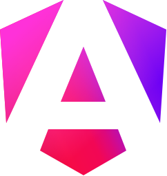

<h1 align="center">
  
	Hola, soy Mel Oviedo
</h1>

  

Estudiante de la Tecnicatura en Programación Informática, apasionada por la tecnología y la innovación. Actualmente desarrollando habilidades en programación, algoritmos y análisis de datos.
<!--Interesado en inteligencia artificial, aprendizaje automático y ciencia de datos. -->
Comprometida con el aprendizaje continuo y con el objetivo de aplicar mis conocimientos en proyectos que aporten valor y soluciones tecnológicas. 

---
<h2>
  
  Lenguajes y herramientas de programación
</h2>

<h3 align="center">🧠 Lenguajes</h3>

  	 
		
		
		

 
<h3 align="center">🎨 Frontend</h3>

  	
  	
  	
  	

 

<h3 align="center">🧩 Backend</h3>

  	

 

<h3 align="center">🛠 Software & Tools</h3>

  	
  	
  	
  	
	

<h2>
  
  GitHub Stats
</h2>
  

<table align="center">
<tr border="none">
<td width="50%" align="center">
	
</td>
<td width="50%" align="center">
  
	<!--  -->
  </td>
</tr>
</table>
